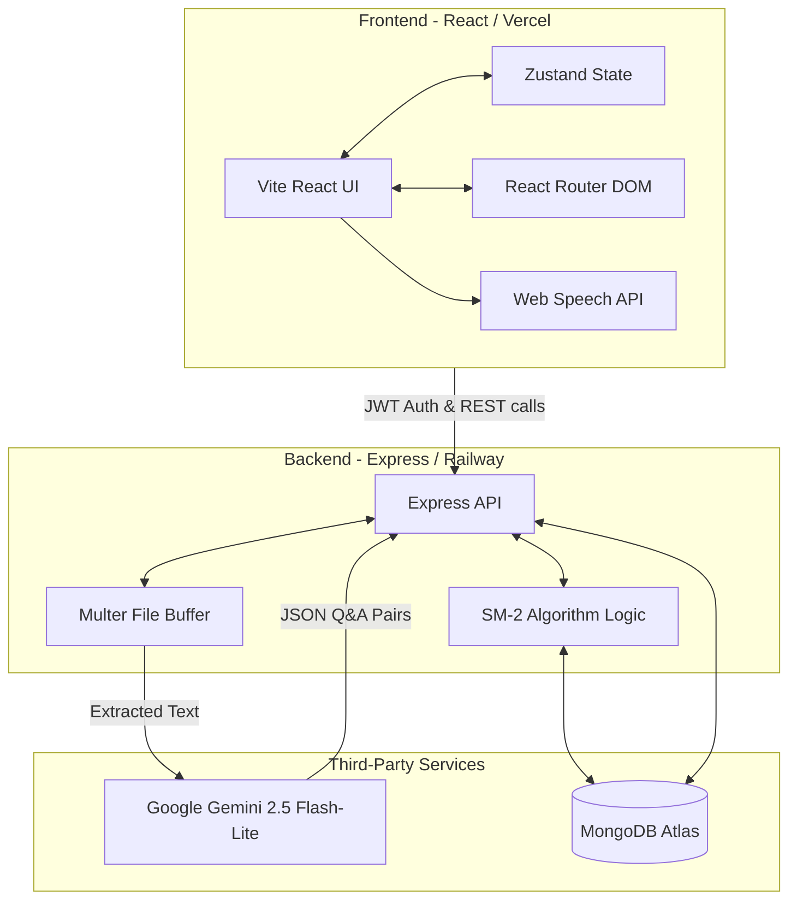

  
  <h1>FlashMind: AI-Powered Spaced Repetition Engine</h1>
  
Supercharge your studying. Upload any PDF and let AI generate, categorize, and schedule your flashcards using proven memory science.

  

    <a href="#live-demo">Live Demo</a> • 
    <a href="#video-walkthrough">Video Walkthrough</a> • 
    <a href="#system-architecture">Architecture</a>
  

---

## 🚀 Live Links (Final Submission)

- **Live Deployed App**: [Insert Vercel URL Here]
- **Backend API**: [Insert Railway URL Here]
- **Video Walkthrough**: [Insert Loom / YouTube Link Here]
- **GitHub Repository**: https://github.com/ketandayke/flashmind

---

## 🧠 What I Built

**FlashMind** is an intelligent, gamified learning platform built to solve the most tedious part of studying: creating the flashcards. 

By simply dragging and dropping a PDF (e.g., lecture notes, a chapter of a textbook), the application parses the text and leverages the Google Gemini 2.5 Flash-Lite API to extract core concepts, generate Question/Answer pairs, and assign semantic topics. 

Beyond generation, FlashMind implements the industry-standard **SuperMemo-2 (SM-2)** spaced repetition algorithm natively. It schedules review dates mathematically, ensuring you study cards exactly when you are about to forget them, optimizing long-term retention. 

### Core Features:
- **AI PDF Parsing:** Upload a PDF and get a fully categorized flashcard deck in seconds.
- **"Mixed Study" Mode:** A global exam-prep mode that aggregates all due cards across your entire account into one shuffled session.
- **Text-to-Speech (TTS):** Native browser voice synthesis reads flashcards aloud for auditory learners.
- **Anki/Quizlet Export:** 1-Click CSV exporting for your generated decks.
- **Gamified Analytics:** Real-time tracking of Retention Scores, 5-stage Memory Progression (New → Mastered), and Weak Topic detection.

---

## 🏗 System Architecture

---

## ⚙️ Tech Stack & Algorithms

### Full Stack Technologies
- **Frontend**: React.js (Vite), Tailwind CSS, Framer Motion (for realistic 3D card flips), Zustand (Auth State).
- **Backend**: Node.js, Express.js.
- **Database**: MongoDB & Mongoose (Aggregations for real-time dashboard stats).
- **File Processing**: `pdf-parse` & `multer` mapped to memory buffers.

### Core Algorithms & Services
1. **SuperMemo-2 (SM-2) Algorithm**:
   - Every card has an `interval`, `easeFactor`, and `repetitions` count stored in MongoDB.
   - When a user grades a card (*Again*, *Hard*, *Easy*), the backend calculates the optimal `nextReviewDate`. If you fail a card (*Again*), the repetition count resets to 0. If you find it easy, the `easeFactor` multiplies, pushing the date out exponentially (e.g., 1 day -> 3 days -> 8 days).
2. **Ephemeral Reinforcement Loop**:
   - While MongoDB handles the long-term date math, the React frontend handles immediate error correction. If a user hits *Again*, the card array dynamically duplicates that object and injects it exactly 4 steps ahead in the current session state stack without spamming the database.
3. **Google Gemini API**:
   - Utilized for high-speed multimodal inference. Leveraging Gemini 1.5/2.5 Flash-Lite's massive context window allows the engine to process large textbook chapters in single, coherent passes, ensuring superior conceptual consistency across flashcards.

---

## 🤔 Why I Made These Choices

- **Custom SM-2 + MongoDB instead of simple due-dates:** Standard due-dates fail because they don't adapt to the user's brain. Implementing SM-2 natively mathematically guarantees optimal learning. I abstracted the algorithm to the backend to ensure absolute data persistence regardless of the device the user logs in with.
- **Gemini over OpenAI/Groq:** Flashcard generation requires both speed and a large context window. While Groq is fast, its context limits require heavy chunking. By using Gemini 2.5 Flash-Lite, we can process much larger PDF sections at once, preserving the "big picture" of the educational material while maintaining near-instantaneous response times.
- **Gamified Dark Mode over Clinical White:** Studying is inherently monotonous. By using Framer Motion micro-interactions, neon glows, and a "Memory Progression" bar that gamifies card stages from *New* 🟥 to *Mastered* 🟦, I capitalized on dopamine-driven behavioral design to make revision addictive.

---

## 💡 What I'd Improve with More Time

If I had an extra week entirely devoted to this application, I would implement:
1. **Vector Database Querying (RAG)**: I would embed the uploaded PDFs into Pinecone. Instead of just studying flashcards, users could type free-form questions into a "Chat with my Notes" interface, letting the AI answer directly from the vectorized syllabus.
2. **Dynamic PDF Chunking Strategies**: Currently, massive textbooks might hit the Gemini context window limit (though it is quite large). I would implement LangChain recursive character chunking to split 100-page chapters intelligently.
3. **Mobile Progressive Web App (PWA)**: Flashcards are primarily a mobile use case (studying on the bus/subway). Adding a PWA manifest to allow offline caching and native app installation would make the platform truly ubiquitous. 

---

Built for optimal learning. 🎓

## 📫 Connect With Me
- **Email**: [ketandayke@gmail.com](mailto:ketandayke@gmail.com)
- **LinkedIn**: [Ketan Dayke](https://www.linkedin.com/in/ketan-dayke-kd050703/)
- **GitHub**: [@ketandayke](https://github.com/ketandayke)

 

<i>App made using Antigravity</i>

